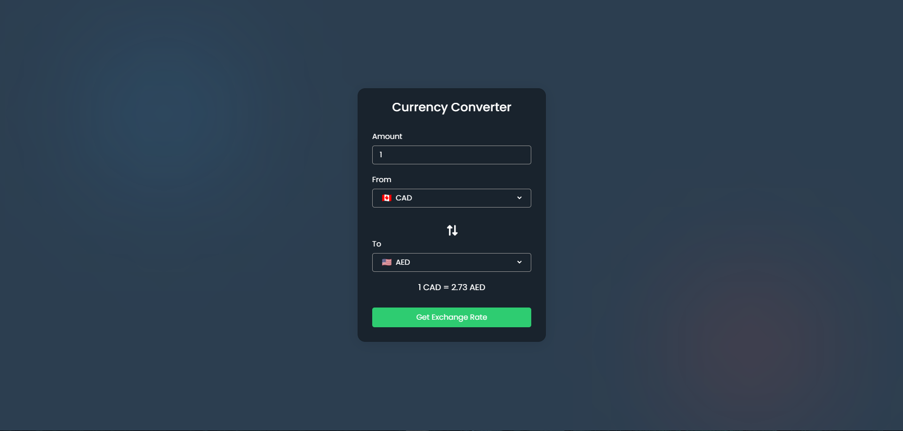

# Currency-Converter with API Integration

Web application created in html, css, and javascript that allows users to convert currencies using real-time exchange rates fetched from an API.
It also features flag icons for easy currency identification.

## Demo

## Features
- Real-Time Conversion: Fetches exchange rates from the API for accurate conversions.
- User-Friendly Interface: Simple and intuitive design for easy use.
- Flag Icon: Easily identify currencies with corresponding flag icons.

## API's Used
- Exchange Rate: https://www.exchangerate-api.com/
- Flags: https://flagpedia.net/download/api

## Link
https://trinhee.github.io/Currency-Converter/
